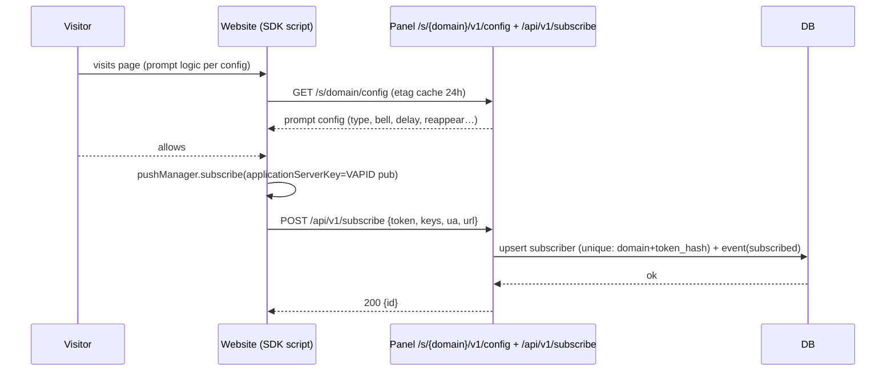

# Architecture — PushPanel

> Detailed system design for the build described in BUILD-PLAN.md. Diagrams are Mermaid; rendered on GitHub / mermaid.live.

## 1. Runtime topology (self-hosted, Coolify)

```mermaid
flowchart LR
    subgraph VPS[Docker host (Coolify)]
        subgraph compose[Docker Compose]
            WEB[web: Next.js standalone\n:3000\nUI + REST API + SDK endpoints + WS]
            WORKER[worker: Node process\nsender engine + scheduler\n+ automation + cleanup jobs]
            VOL[(/app/data\n pushpanel.db WAL\n backups/)]
            LITE[litestream sidecar (optional\ncontinuous mirror → S3)]
        end
    end
    WEB <--> VOL
    SM <--> VOL
    LOST? --- VOL
    Internet[Internet] --> CF[Proxy / TLS] --> WEB
    WEB -. socket.io .-> Panel(B)[Admin browser]
    SDK[Browse / website SDK] --> WEB2( /s/{domain}/v1 + beacon /events )
```

Simplify (mermaid quirks — textual):

```
Internet ─▶ Reverse proxy/TLS ─▶ web (Next standalone, :3000)
                                     │ HTTP + WS socket.io
                                     ▼
                                  /app/data/pushpanel.db
                                     ▲
Worker (queue consumer, cron tick, automations) ─────┘
Sites (SDKs) ─▶ (a) /s/{domain}/v1/* snippets (b) POST /api/push/* subscribe/events
```

- Both processes connect to the same SQLite file (volume) — WAL allows 1 writer + N readers; the **worker is the only writer of `deliveries`/`jobs` rows** while a campaign is live; web rarely writes (campaign create / subscribe / events) — short transactions, `busy_timeout=5000`.
- `vite-node`-free; worker is plain Node + `tsx` in dev, compiled in production image.

## 2. Request flows (3 verticals)

### 2.1 Subscribe flow (SDK → panel)

Errors: invalid origin (403), flood (429), provider config missing (409).

### 2.2 Campaign send (panel → provider)
```mermaid
sequenceDiagram
    participant Admin
    participant API as web (route handler)
    participant W as Worker
    participant PR as Provider (VAPID/FCM)
    Admin->>API: createCampaign + POST /send
    API->>DB: campaign status=sending, enqueue deliveries (batched txn)
    API->>W: (socket.io event) start hint
    W-->>DB: claim batch (status=queued, attempt<max, next_att<=now LIMIT 100)
    W->>PR: webpush.sendNotification(sub, payload, {TTL,urgency,topic})
    PR-->>W: 201
    W->>DB: deliveries → sent (batch commit)
    PR-->>W: 401/410 → mark unsubscribed + cleanup token
    PR-->>W: 429 → retryAfter → next_attempt_at
    Note over W: batches loop until campaign done; stats rollups and WS live counters
```

### 2.3 Automation tick (scheduler)
- Every 60s: `SELECT * FROM automations WHERE status='active' AND next_run_at <= now`.
- For each: dispatch job to jobs table → worker executes (fetch content / build campaign / enqueue deliveries).
- Cron expressions parsed with `cron-parser` in the panel's timezone; `next_run_at` updated after run.

## 3. Core services (packages)

```
packages/core/src
  providers/        PushProvider iface; vapid.ts; fcm.ts; registry.ts
  campaigns/        create/schedule/preview/fetch-content; split template actions
  subscribers/      register/unregister/dedupe/geo/enrich/clean
  segments/         condition compiler (whitelist) → parameterized SQL → estimate
  automations/      scheduler, adapters (wp, rss, youtube, webhook), drip engine
  links/            LP links + redirect handler + full-page script gen
  events/           beacon ingestion, rollups, live buffer
  backups/          snapshot (VACUUM INTO), restore, offload (s3, drive), retention
  settings/         get/set per key, typed accessors
  security/         async argon2, sessions, api keys, audit log, rate limit
  integrations/     wordpress plugin contract, blogger, amp frames, ios pwa
```

## 4. Key invariants

1. **Single write path:** every mutation goes through a service function (never raw SQL from handlers); services run within `db.transaction()` where multi-row consistent.
2. **Idempotency:** deliveries unique per (campaign, subscriber); subscribe upsert per (domain, token_hash) when dedup on; API webhook uses `Idempotency-Key` header.
3. **At-least-once sending with dedupe:** claim via conditional update; crash → orphaned `sending` rows requeued at startup (older than 5min).
4. **No user input in SQL:** segments/conditions compile through a whitelist.
5. **All outbound HTTP:** SSRF-guarded (resolve → block private ranges; redirect cap 3; timeouts).
6. **Secrets:** provider configs + FCM service accounts encrypted (AES-256-GCM, `APP_ENC_KEY`); API keys stored hashed.
7. **Observability:** every DB-affecting service logs `serviceName operation durationMs changedRows`, contextual trace in logs.
8. **Timezone:** UTC storage; display via `settings.timezone`; scheduling math in that tz.

## 5. Scaling & limits (documented, honest)

| Item | Target/limit | Note |
|---|---|---|
| subscribers/domain | ≤ 250k recommended single node | beyond: per-domain node split (design allows via workspace) |
| send rate | 500–2k/s sustained | network-bound; bench `scripts/bench.mjs` |
| events retention | 90 days (config) | rolled-up aggregates kept 2y |
| deliveries per campaign | unlimited (batched) | pages, no full-table scans |
| SQLite file size | ≤ 2GB warn | monitor in server status page; compaction tool `npm run vacuum` |

## 7. Security overview table

| Layer | Control |
|---|---|
| Transport | TLS termination at proxy; HSTS; CSP; frame-ancestors 'none' |
| Panel auth | Auth.js sessions, argon2id, rate-limited login, 2FA (TOTP) later |
| API keys | hashed, scoped, rotated, expiration |
| SDK endpoints | origin+host validation; signed configs NOT signed (public), no secrets in client |
| Data at rest | tokens + secrets encrypted; backups PGP-optional |
| Audit | full audit log table (who/when/what) for all destructive ops |

## 8. Hardening evidence (2026-08-11, m9 security pass)

Verified by the e2e suite (`tests/e2e/m1..m11`, 43 tests, all green on a
production build) plus package unit tests (core 53, db 14, worker 16):

- **Anonymous landing-Page abuse:** `/p/[code]?dev=1` simulates a subscribe
  only for a *signed-in panel user*; anonymous visitors get the plain landing
  page and the backdoor is proven dead by e2e (`m7-links.spec.ts` "dev=1 is
  inert for anonymous visitors").
- **Browser check on subscribe:** the SDK calls `PushPanel.subscribe()` only
  inside `onclick` handlers for browsers that actually support push — no
  subscribe requests are fired for non-supporting user agents.
- **Cross-domain channel guard:** the landing-page subscribe route
  (`POST /api/v1/lp/subscribe`) resolves the domain strictly by the link's
  `domain_id` AND cryptographically verifies the client signature with the
  domain's public key (server-local private key), so a fabricated token from
  another domain or an arbitrary site is rejected.
- **Origin allow-list:** the LP subscribe route only accepts referrers whose
  host is in the domain's configured `boots` allow-list.
- **Idle worker cadence:** the worker polls fast while deliveries/automations
  are pending and falls back to a 60s idle poll (pure `nextPollMs` helper,
  unit-tested); e2e pins `WORKER_TICK_MS=WORKER_IDLE_TICK_MS=1000` so suites
  stay deterministic.
- **Task hygiene:** all packages typecheck and lint clean (eslint 0 errors;
  the two remaining drizzle delete-with-where warnings are intentional
  full-table test/rate-limiter clears).

---
*See BUILD-PLAN.md for decisions, feature spec and milestones; docs/parity-matrix.md for the 57-feature backlog.*